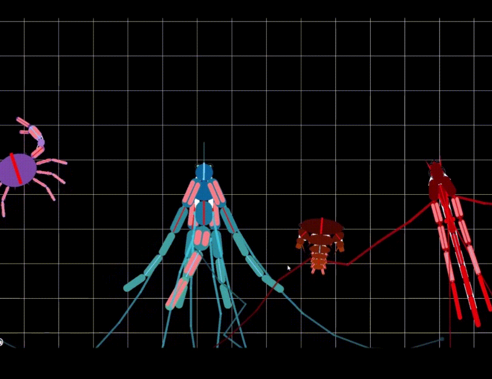
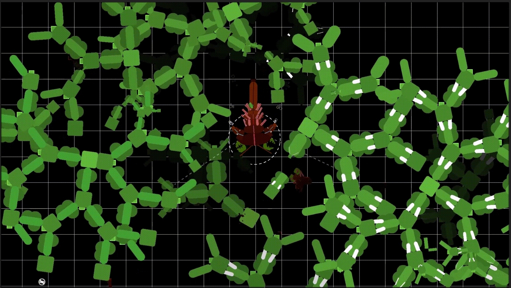
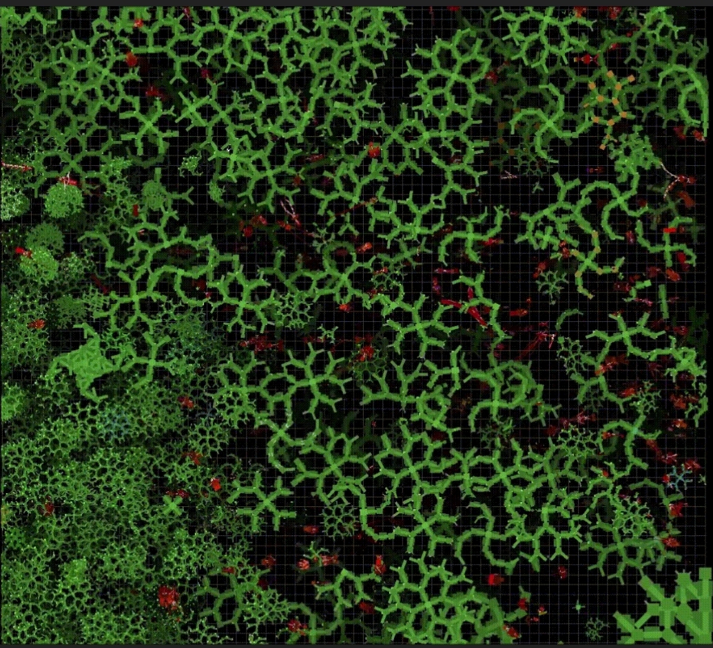
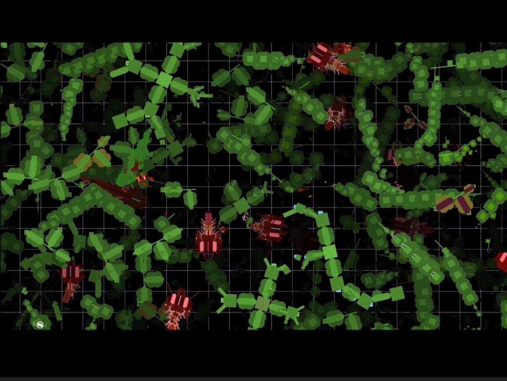
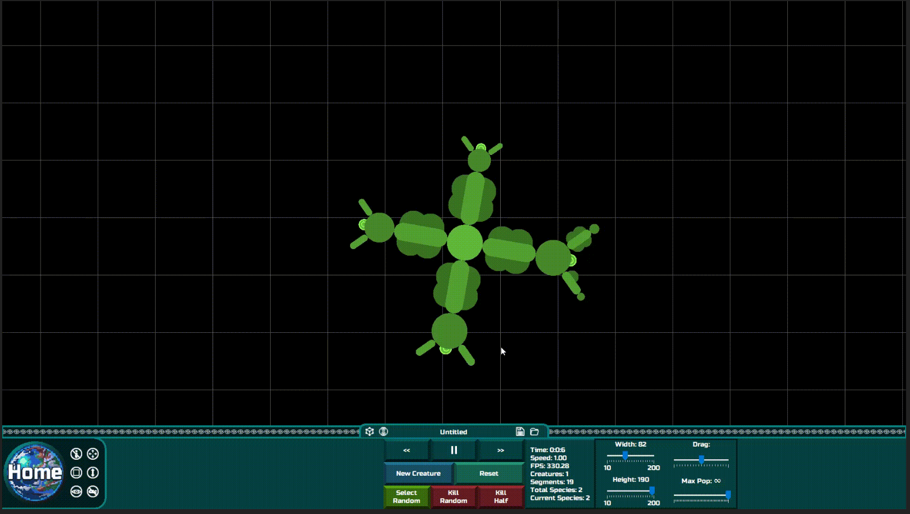
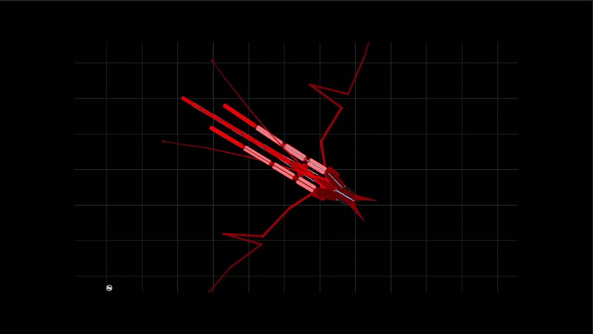
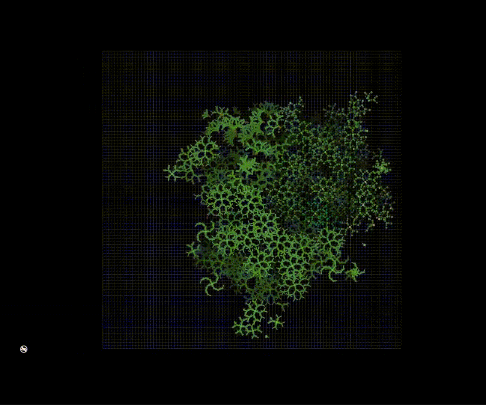

# HyperLife
A realtime multicellular organism evolution simulator with Verlet integration.

Cells evolve recursive microstructures called segments which contain "proteins". 
Each creature is made up of these segments, which can contain nerves to propagate signals and bones to increase the tension in the angle of the segments (useful for upright plants for instance)
These "proteins" provide minimal functionality to the creates such as eyes, spikes, jets, rigid/soft touch sensors, chloroplasts, reproductive organs, jaws, myelin (to speed up signal propagation)

The system also uses verlet integration for realistic motion, and fluid/light simulations to aid the evolution process.

The simulator also has a beautiful GUI with an auto generated phylogenetic tree and "blueprint" mode, showing an outline of the fully formed creature.

